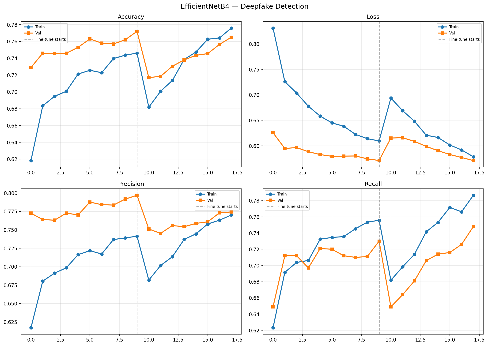
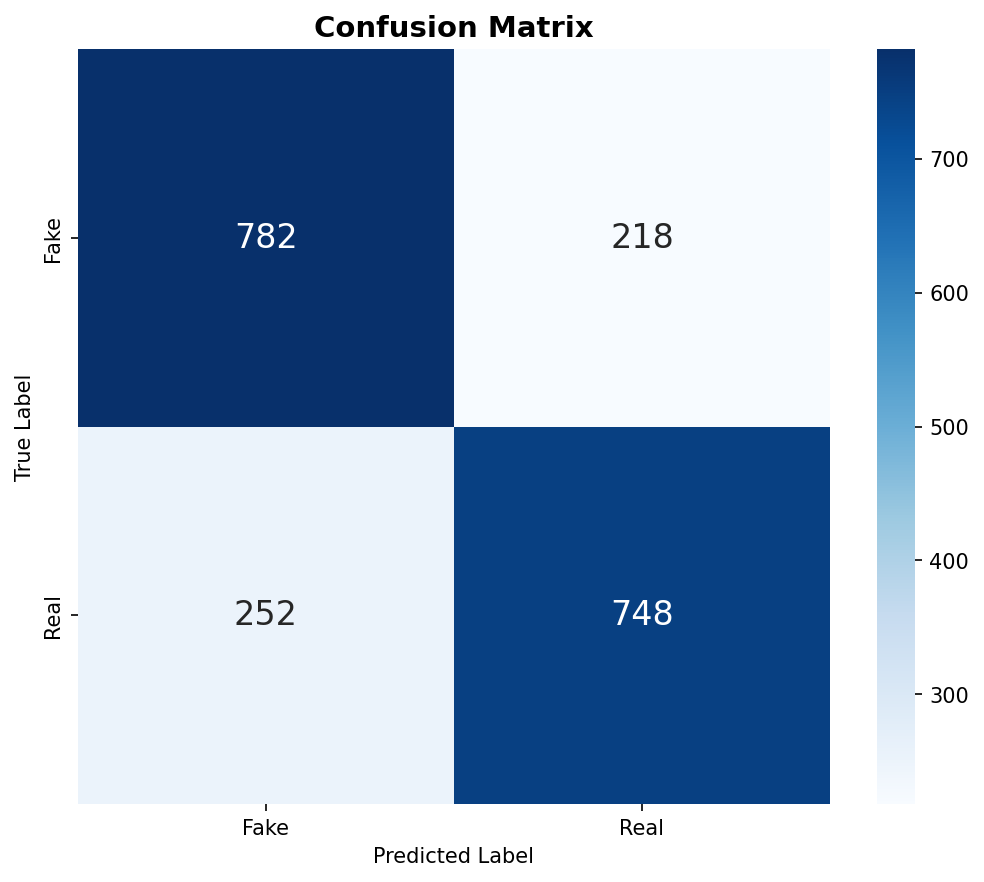
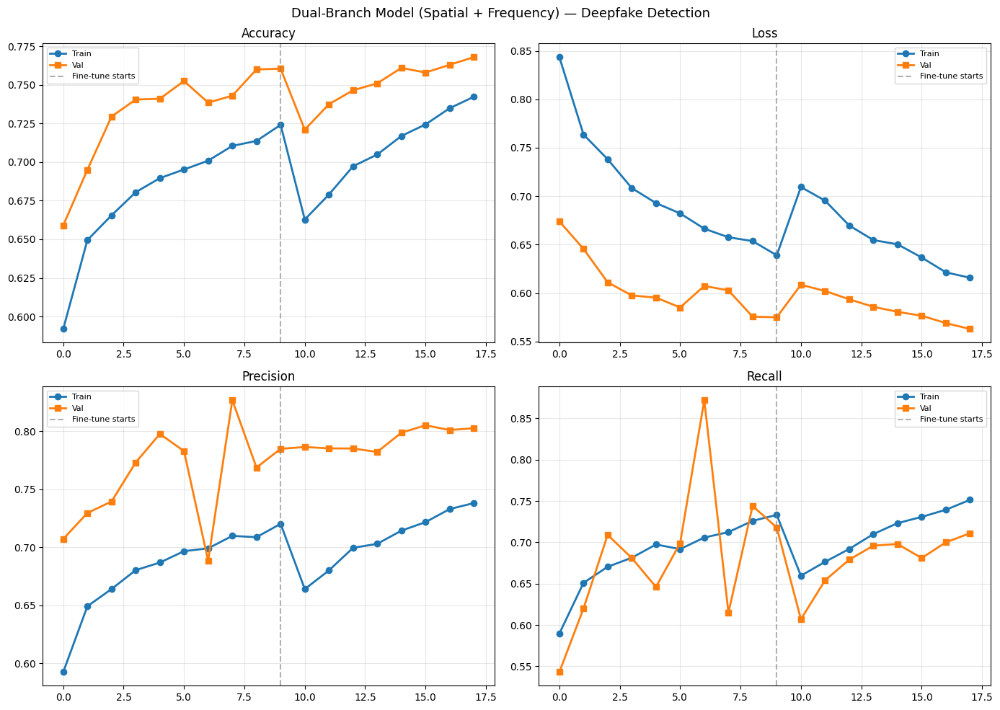
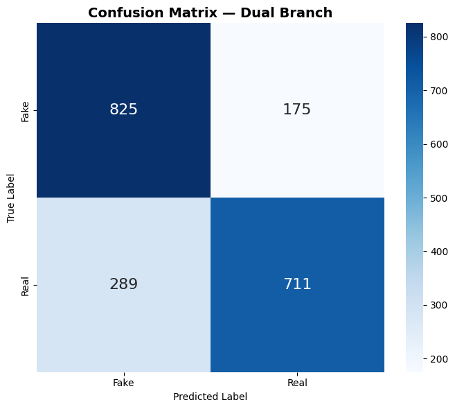
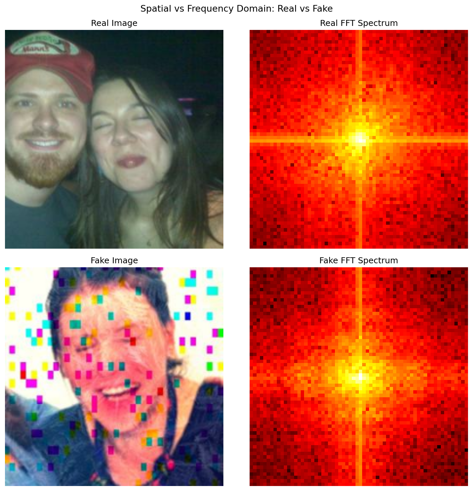
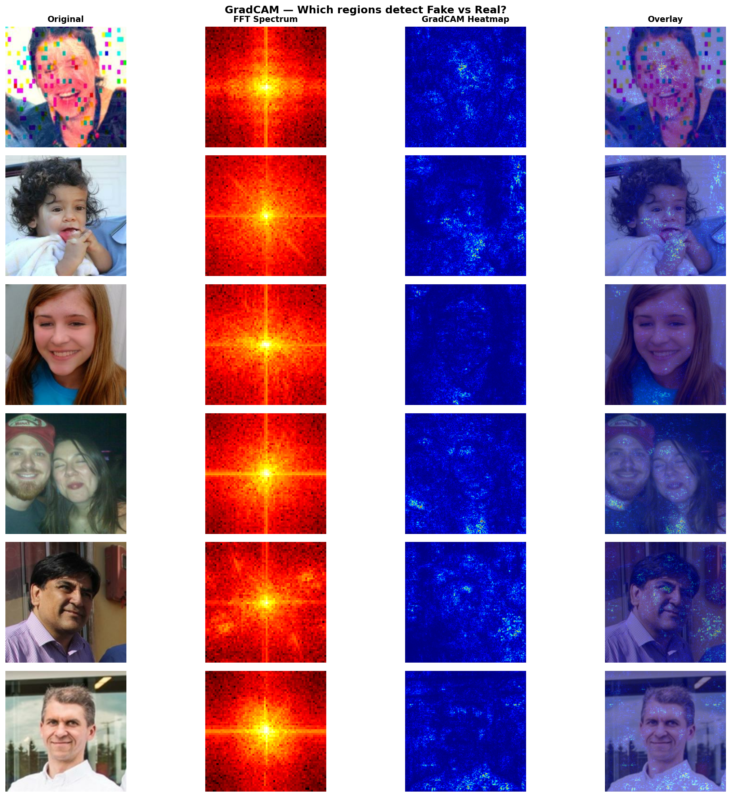
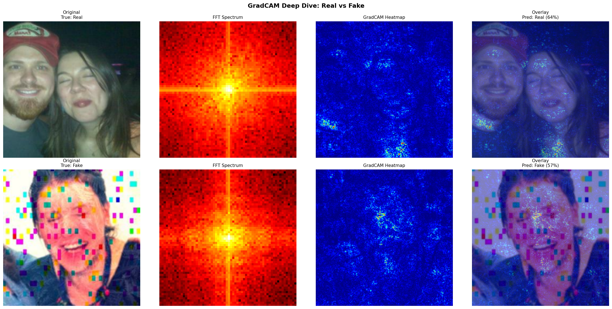

# 🛡️ DeepFake Shield — AI-Powered Facial Manipulation Detector

> Detects manipulation artifacts in both spatial and frequency domains, with GradCAM-based visual explanations highlighting tampered facial regions.

[](https://huggingface.co/spaces/Krishna-Jaiswal/deepfake-shield)
[](https://python.org)
[](https://tensorflow.org)
[](LICENSE)

---

## 🎯 Project Overview

DeepFake Shield is an end-to-end deepfake detection system that goes beyond simple binary classification. It combines **spatial feature extraction** (what the image looks like) with **frequency domain analysis** (how GAN artifacts manifest in the FFT spectrum), and produces **explainable predictions** using GradCAM heatmaps.

---

## 🖥️ Live Demo

Try it on Hugging Face Spaces → upload any face image and get:
- ✅ Real / 🔴 Fake prediction with confidence score
- FFT frequency spectrum visualization
- GradCAM heatmap showing which facial regions triggered the prediction

---

## 🧠 Architecture

```
Input Image (224×224×3)
        │
        ├──► Spatial Branch
        │       └── EfficientNetB4 (pretrained ImageNet)
        │               └── GlobalAveragePooling → Dense(256)
        │
        ├──► Frequency Branch
        │       └── FFT → Log Magnitude Spectrum (64×64×1)
        │               └── Conv2D(32) → Conv2D(64) → Conv2D(128)
        │                       └── GlobalAveragePooling → Dense(128)
        │
        └──► Fusion
                └── Concatenate [256 + 128 = 384]
                        └── Dense(128) → Dense(1, sigmoid)
                                └── Prediction + GradCAM
```

### Why Two Branches?

| Branch | Detects |
|---|---|
| Spatial (EfficientNetB4) | Pixel-level artifacts, unnatural textures, blending seams |
| Frequency (FFT CNN) | GAN checkerboard patterns, anomalous high-frequency spikes invisible to human eye |

---

## 📊 Results

### Step 1 — Baseline (EfficientNetB4)

| Metric | Score |
|---|---|
| Accuracy | 77.6% |
| Precision | 78.2% |
| Recall | 76.5% |
| F1-Score | 77.4% |




---

### Step 2 — Dual Branch (Spatial + Frequency)

| Metric | Score |
|---|---|
| Accuracy | 75.6% |
| Precision | 79.2% |
| Recall | 69.6% |
| F1-Score | 74.1% |




#### FFT Spectrum: Real vs Fake


---

### Step 3 — GradCAM Explainability

GradCAM highlights **which facial regions** the model focused on to make its prediction.

- Real faces → diffuse attention across the face
- Fake faces → concentrated attention on eye corners, mouth edges, hair boundaries




---

## 🗂️ Project Structure

```
Deepfake-Shield/
    ├── notebooks/
    │   ├── deepfake-efficientnet.ipynb      # Step 1: Baseline model
    │   ├── deepfake-frequency-branch.ipynb  # Step 2: Dual branch + FFT
    │   └── deepfake-gradcam.ipynb           # Step 3: GradCAM explainability
    ├── app/
    │   ├── app.py                           # Step 4: Gradio app
    │   └── requirements.txt
    ├── results/                             # Training curves, confusion matrices, GradCAM images
    └── README.md
```

---

## 🗃️ Dataset

- **Name:** Deepfake and Real Images
- **Source:** [Kaggle — manjilkarki](https://www.kaggle.com/datasets/manjilkarki/deepfake-and-real-images)
- **Size:** 140,000+ images (balanced Real + Fake)
- **Training:** 10,000 images used (5,000 per class)

---

## 🏗️ Tech Stack

| Tool | Purpose |
|---|---|
| TensorFlow / Keras | Model training |
| EfficientNetB4 | Spatial feature extraction |
| NumPy FFT | Frequency domain features |
| GradCAM | Explainability |
| Gradio | Web interface |
| Hugging Face Spaces | Deployment |
| Kaggle | Training environment (T4 GPU) |

---

## 🚀 Run Locally

```bash
git clone https://github.com/KrishnaJaiswal007/Deepfake-Shield
cd Deepfake-Shield/app
pip install -r requirements.txt
# Add deepfake_dual_branch_final.keras to app/ folder
python app.py
```

---

## 📈 Training Details

- **Phase 1:** EfficientNetB4 frozen, train head only (10 epochs)
- **Phase 2:** Fine-tune top 30 layers of EfficientNetB4 (8 epochs)
- **Optimizer:** Adam (LR=1e-4, fine-tune LR=1e-5)
- **Loss:** Binary Crossentropy with label smoothing (0.1)
- **Callbacks:** EarlyStopping, ReduceLROnPlateau, ModelCheckpoint

---

## ⚠️ Limitations

- Model accuracy ~77% — not suitable for production use
- Trained on limited data (10k images) — full dataset would improve accuracy
- GradCAM uses input-gradient method — not as precise as layer-based GradCAM
- Does not support video input yet

---

## 🔮 Future Work

- [ ] Train on full 140k dataset for better accuracy
- [ ] Add video support (frame extraction + majority vote)
- [ ] Replace input-gradient GradCAM with proper layer-based GradCAM
- [ ] Add SHAP explainability
- [ ] Test on DFDC (Deepfake Detection Challenge) dataset

---

## 👨‍💻 Author

**Krishna Jaiswal**
B.Tech(AI & ML) — VIPS-TC, GGSIPU

- 🐙 [GitHub](https://github.com/KrishnaJaiswal007)
- 🤗 [Hugging Face](https://huggingface.co/Krishna-Jaiswal)

---

## 📄 License

MIT License — free to use, modify, and distribute with attribution.
